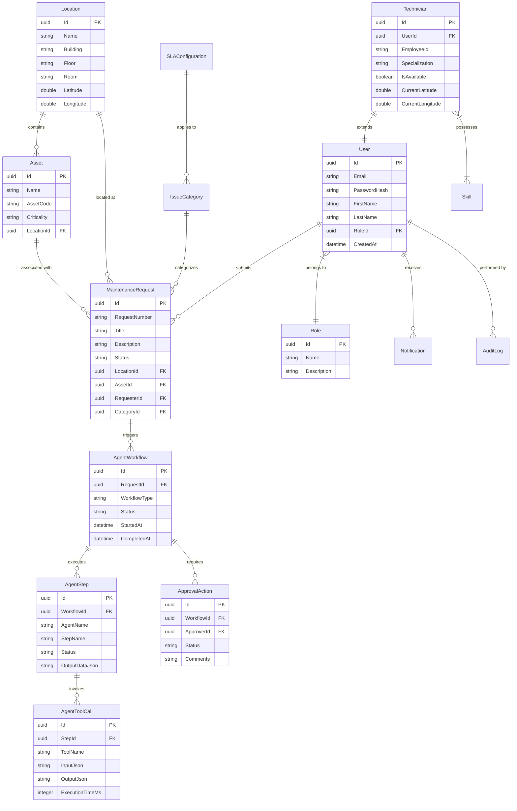

# FixFlow AI — Entity Relationship Diagram (Shared Foundation)

```mermaid
erDiagram
    User ||--o{ MaintenanceRequest : "submits"
    User }|--|| Role : "belongs to"
    Location ||--o{ Asset : "contains"
    Location ||--o{ MaintenanceRequest : "located at"
    Asset ||--o{ MaintenanceRequest : "associated with"
    IssueCategory ||--o{ MaintenanceRequest : "categorizes"
    
    Technician ||--|| User : "extends"
    Technician }|--|{ Skill : "possesses"
    
    MaintenanceRequest ||--o{ AgentWorkflow : "triggers"
    AgentWorkflow ||--o{ AgentStep : "executes"
    AgentStep ||--o{ AgentToolCall : "invokes"
    AgentWorkflow ||--o{ ApprovalAction : "requires"
    
    User ||--o{ Notification : "receives"
    User ||--o{ AuditLog : "performed by"
    
    SLAConfiguration ||--o{ IssueCategory : "applies to"

    User {
        uuid Id PK
        string Email
        string PasswordHash
        string FirstName
        string LastName
        uuid RoleId FK
        datetime CreatedAt
    }

    Role {
        uuid Id PK
        string Name
        string Description
    }

    Location {
        uuid Id PK
        string Name
        string Building
        string Floor
        string Room
        double Latitude
        double Longitude
    }

    Asset {
        uuid Id PK
        string Name
        string AssetCode
        string Criticality
        uuid LocationId FK
    }

    MaintenanceRequest {
        uuid Id PK
        string RequestNumber
        string Title
        string Description
        string Status
        uuid LocationId FK
        uuid AssetId FK
        uuid RequesterId FK
        uuid CategoryId FK
    }

    Technician {
        uuid Id PK
        uuid UserId FK
        string EmployeeId
        string Specialization
        boolean IsAvailable
        double CurrentLatitude
        double CurrentLongitude
    }

    AgentWorkflow {
        uuid Id PK
        uuid RequestId FK
        string WorkflowType
        string Status
        datetime StartedAt
        datetime CompletedAt
    }

    AgentStep {
        uuid Id PK
        uuid WorkflowId FK
        string AgentName
        string StepName
        string Status
        string OutputDataJson
    }

    AgentToolCall {
        uuid Id PK
        uuid StepId FK
        string ToolName
        string InputJson
        string OutputJson
        integer ExecutionTimeMs
    }

    ApprovalAction {
        uuid Id PK
        uuid WorkflowId FK
        uuid ApproverId FK
        string Status
        string Comments
    }
```
