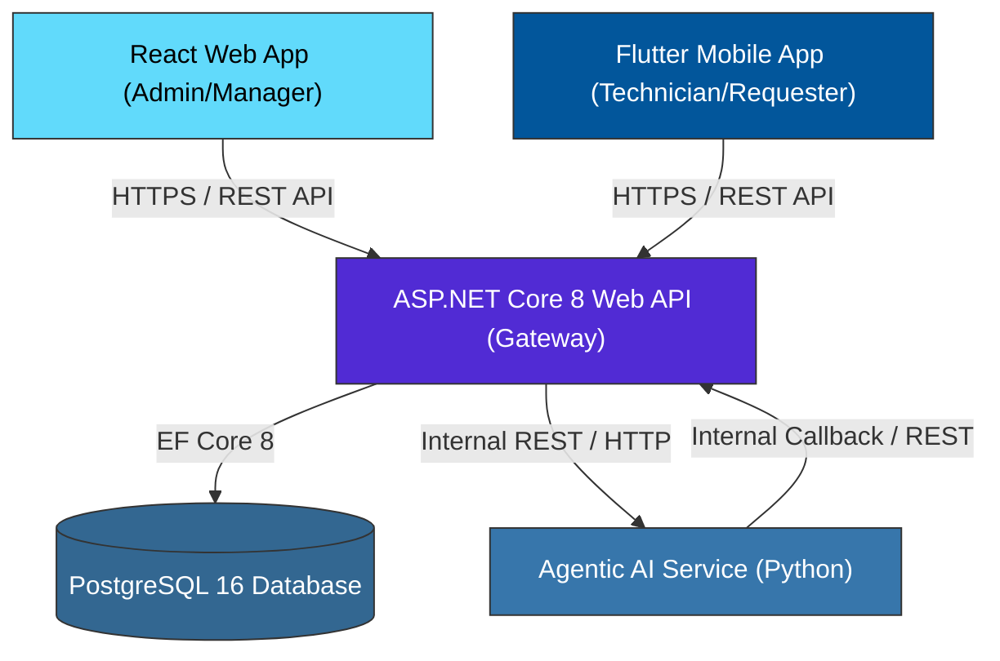
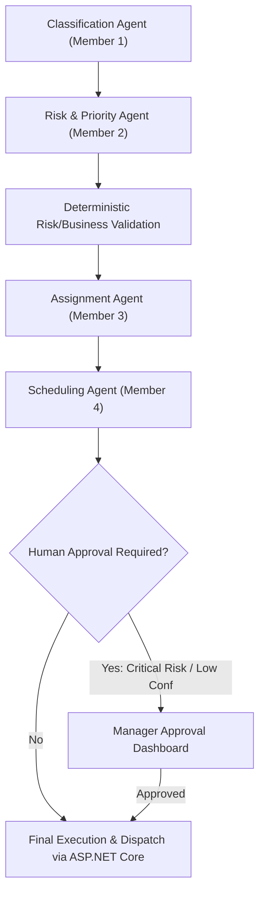

# FixFlow AI — System Architecture Specification

## Overview & Architecture Rules

FixFlow AI enforces a **strict single-gateway architecture** compliant with the SE3090 assignment rubric:

### Mandatory Gateway Rules
1. **Public API Gateway**: ASP.NET Core 8 Web API is the **ONLY** public endpoint accessible by React Web and Flutter Mobile.
2. **Database Isolation**: React and Flutter MUST NEVER connect directly to PostgreSQL.
3. **Agentic AI Isolation**: React and Flutter MUST NEVER connect directly to the Python Agentic AI microservice.
4. **Internal Agent Orchestration**: ASP.NET Core invokes the internal Agentic AI service when business workflows (e.g. classification, risk scoring, technician matching, scheduling) require agent processing.

---

## Agent Workflow Pipeline

The internal Python Agentic AI service processes maintenance workflows through a sequential pipeline:

1. **Classification Agent** (Member 1) — Request intake, issue classification, confidence scoring.
2. **Risk & Priority Agent** (Member 2) — Asset criticality, impact and likelihood assessment, risk matrix score, risk level, priority, SLA response window, escalation flag, and explanation.
3. **Deterministic Risk/Business Validation** — Deterministic safety overrides, schema enforcement, and human approval threshold checks.
4. **Assignment Agent** (Member 3) — Technician skill matching and candidate ranking.
5. **Scheduling Agent** (Member 4) — Conflict-free schedule proposal.
6. **Human Approval where required** — Manager sign-off for critical risk levels or safety hazard flags.
7. **Final execution** — Work order dispatch and persistence via ASP.NET Core Web API.

---

## Shared Foundation Design Patterns
- **Layered Architecture**: Controllers $\rightarrow$ Services $\rightarrow$ EF Core DbContext $\rightarrow$ PostgreSQL.
- **Convention-Based Assembly Discovery**: DbContext uses `ApplyConfigurationsFromAssembly` so student entity configurations are automatically picked up without touching shared files.
- **Explicit Member Sections**: Shared files (`AppRoutes.jsx`, `app_router.dart`, `Program.cs`, `orchestrator.py`) contain copy-paste insertion sections marked for Members 1 through 4.
